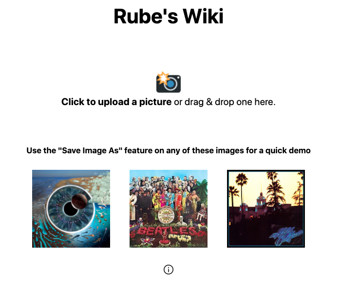

# rbwiki

[rbwiki.mahanna.dev](https://rbwiki.mahanna.dev)

A <a href="https://en.wikipedia.org/wiki/Rube_Goldberg_machine">Rube Goldberg Machine</a> for accessing condensed Wikipedia page content through photo recognition. 

Built with Express, using Typescript, JQuery, Handlebars, HTML, CSS, and the Google Cloud Vision & MediaWiki APIs.

It was originally intended for taking pictures of LP Records and getting condensed Wiki info about their album & band, but it can work with other things, like a book cover or a famous face. 

  

To run:
- You will need a [Google Cloud API Key](https://cloud.google.com/docs/authentication/api-keys) (set as GCP_API_KEY in your `.env`)
- `yarn install`
- `yarn build`
- `yarn dev`
